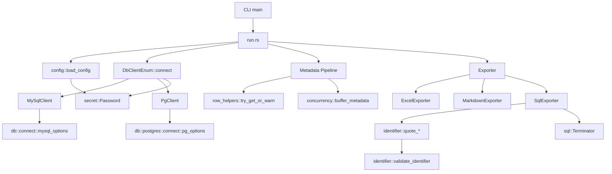
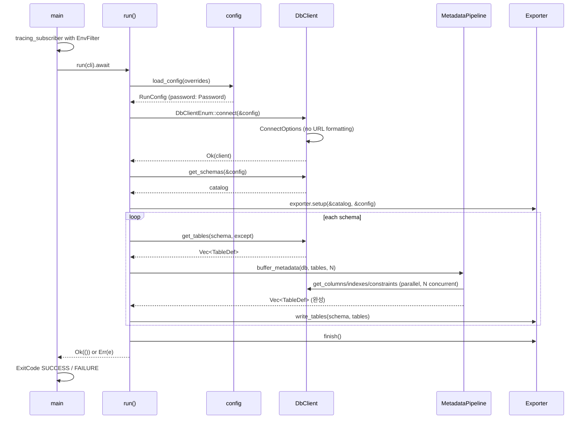
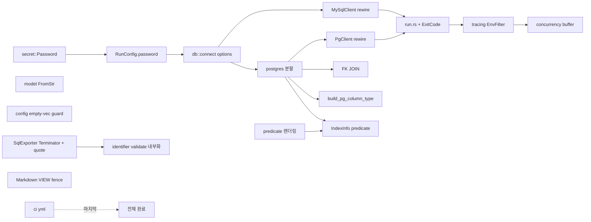

# Design Document

## Overview

본 설계는 `td-export` Rust 프로젝트의 15개 코드 품질 개선을 소규모 리팩토링의 연속으로 구현한다. 모든 변경은 **behavior-preserving**을 원칙으로 하며, 단 하나의 예외는 검증된 버그인 Markdown VIEW 코드블록 렌더링 수정이다.

### 설계 원칙

1. **리팩토링 골든룰 준수** (`.kiro/steering/refactoring.md`): 모든 변경은 테스트 선행, diff 100줄 이하, 단일 논리 변경, 단독 커밋 가능.
2. **기존 공개 API 불변**: `DbClient` trait, `Exporter` trait, `AppError` variants는 추가만 하고 삭제/변경하지 않는다.
3. **관심사 경계**: 보안(Req 1, 4), 정확성(Req 2, 3, 11, 12), 구조(Req 6, 8), 관측성(Req 5, 7), 성능(Req 9, 10), 부가(Req 13, 14)는 독립 커밋으로 분리되도록 모듈 경계를 그린다.
4. **타입 시스템 최대 활용**: `Password` 래퍼, `DbType` 분기 등 컴파일 타임 검증을 선호한다.
5. **가산(additive) 변경**: 신규 헬퍼(`try_get_or_warn`, `Password`, `Terminator`)를 먼저 추가하고, 호출부를 점진 교체한다.

### 현재 구조 요약

```
src/
├── main.rs            (200+줄: CLI, match-exit 반복)
├── lib.rs             (모듈 re-export)
├── config.rs          (대화형 설정)
├── error.rs           (AppError)
├── identifier.rs      (인용·검증)
├── model.rs           (RunConfig, DbType, OutputFormat, TableDef ...)
├── db/
│   ├── mod.rs         (DbClient trait, DbClientEnum)
│   ├── mysql.rs       (MySqlClient: URL 기반 연결)
│   └── postgres.rs    (PgClient: 1,216줄 — 리팩토링 대상)
└── export/
    ├── mod.rs
    ├── excel.rs
    ├── markdown.rs    (VIEW 코드블록 버그)
    └── sql.rs         (식별자 미인용, 세미콜론 중복)
```

### 개선 후 구조

```
src/
├── main.rs            (축소: ExitCode 반환, run() 위임)
├── run.rs             (신규: async fn run(...) -> anyhow::Result<()>)
├── secret.rs          (신규: Password 래퍼 + Debug/Display 마스킹)
├── config.rs          (빈 Vec 가드 추가)
├── error.rs           (신규 variants: ColumnMissing 등)
├── identifier.rs      (quote_*에 validate_* 내부 호출)
├── model.rs           (FromStr 구현; RunConfig.password: Password)
├── db/
│   ├── mod.rs         (변경 없음)
│   ├── connect.rs     (신규: ConnectOptions 빌더 공통)
│   ├── row_helpers.rs (신규: try_get_or_warn)
│   ├── mysql.rs       (ConnectOptions 사용, row_helpers 호출)
│   └── postgres/      (분할)
│       ├── mod.rs     (PgClient 본체, DbClient impl)
│       ├── connect.rs (PgConnectOptions 빌드)
│       ├── ddl.rs     (build_pg_ddl_from_metadata, FK JOIN 쿼리)
│       ├── parse.rs   (parse_pg_indexdef, split_top_level_commas,
│       │              extract_columns_from_indexdef, parse_fk_actions)
│       └── types.rs   (PgDdl{Column,Constraint}, build_pg_column_type)
├── export/
│   ├── mod.rs
│   ├── excel.rs       (predicate 렌더링 추가)
│   ├── markdown.rs    (VIEW 코드블록 수정, predicate 렌더링)
│   └── sql.rs         (quote_identifier 사용, Terminator)
└── concurrency.rs     (신규: buffer_unordered 헬퍼)

.github/workflows/ci.yml   (신규)
tests/                     (신규 회귀 테스트 추가)
```

## Architecture

### 레이어 다이어그램



### 실행 흐름 (개선 후)



### 모듈 책임 매트릭스

| 모듈 | 책임 | 연결된 Req |
|---|---|---|
| `main.rs` | `ExitCode` 반환, `tracing` 초기화, `run()` 호출 | 6, 7 |
| `run.rs` | 비즈니스 로직 오케스트레이션 | 6, 9 |
| `secret.rs` | 비밀번호 래퍼 + Debug 마스킹 | 1 |
| `db/connect.rs` | MySQL/PG `ConnectOptions` 빌드 | 1 |
| `db/row_helpers.rs` | `try_get_or_warn` | 5 |
| `db/postgres/` | PG 전용 기능 4개 서브모듈로 분할 | 8, 10, 11 |
| `concurrency.rs` | `buffer_unordered` 기반 메타데이터 수집 | 9 |
| `export/sql.rs` | `Terminator` + 식별자 인용 | 2 |
| `export/markdown.rs` | VIEW 코드블록 수정 + predicate 렌더링 | 3, 11 |
| `identifier.rs` | `quote_*` 내부에서 `validate_*` 호출 | 4 |
| `config.rs` | 빈 Vec 정규화 | 12 |
| `.github/workflows/ci.yml` | fmt/clippy/test/llvm-cov/audit | 13 |
| `model.rs` | `FromStr` + `ValueEnum` 구현 | 14 |

### 변경 시퀀스 (의존성 DAG)



## Components and Interfaces

### 1. `secret::Password` (신규)

비밀번호를 **Debug/Display에서 자동 마스킹**하는 래퍼.

```rust
// src/secret.rs
pub struct Password(String);

impl Password {
    pub fn new(s: String) -> Self { Self(s) }
    pub fn expose(&self) -> &str { &self.0 }
}

impl std::fmt::Debug for Password {
    fn fmt(&self, f: &mut std::fmt::Formatter<'_>) -> std::fmt::Result {
        f.write_str("Password([REDACTED])")
    }
}

impl std::fmt::Display for Password {
    fn fmt(&self, f: &mut std::fmt::Formatter<'_>) -> std::fmt::Result {
        f.write_str("[REDACTED]")
    }
}

impl Clone for Password { /* ... */ }
```

**근거**: `.kiro/steering/security.md`의 "No sensitive data exposed in error messages" + `.kiro/steering/observability.md`의 "Do not log passwords, tokens". `RunConfig`는 이미 수동 `Debug`로 `[REDACTED]` 처리 중이지만, 개별 필드 `password: String`이 오용되는 경로(`format!("{password}")`)를 차단해야 한다. 래퍼 타입으로 쥐면 컴파일러가 막는다.

**대안 고려**: `secrecy` 크레이트 도입 → 거부. 추가 의존성 가치가 70줄 수동 구현을 넘지 않음 (`.kiro/steering/dependencies.md`).

### 2. `db::connect` (신규 모듈)

MySQL/PostgreSQL `ConnectOptions`를 URL 문자열 포매팅 없이 빌드.

```rust
// src/db/connect.rs
use sqlx::mysql::MySqlConnectOptions;
use sqlx::postgres::PgConnectOptions;
use crate::model::RunConfig;

pub fn mysql_options(config: &RunConfig) -> MySqlConnectOptions {
    MySqlConnectOptions::new()
        .host(&config.endpoint)
        .port(config.port)
        .username(&config.user)
        .password(config.password.expose())
        .database("information_schema")
}

pub fn pg_options(config: &RunConfig) -> PgConnectOptions {
    let db = config.database.as_deref().unwrap_or("postgres");
    PgConnectOptions::new()
        .host(&config.endpoint)
        .port(config.port)
        .username(&config.user)
        .password(config.password.expose())
        .database(db)
        .application_name("td-export")
}
```

**근거**: sqlx의 `ConnectOptions`는 빌더 메서드를 통해 직접 값을 설정하므로 URL 인코딩 문제가 발생하지 않는다. `@`, `:`, `%` 등이 비밀번호에 포함되어도 안전.

**호환성**: `MySqlPool::connect_with(options)` 및 `PgPool::connect_with(options)`는 기존과 동일한 풀을 반환. 호출부에서 한 줄만 변경.

### 3. `db::row_helpers::try_get_or_warn` (신규)

`try_get()` 실패 시 `warn` 로그를 찍고 기본값을 반환. 중복 경고 방지를 위한 dedup.

```rust
// src/db/row_helpers.rs
use std::sync::Mutex;
use std::collections::HashSet;
use std::sync::OnceLock;
use sqlx::Row;

static LOGGED: OnceLock<Mutex<HashSet<String>>> = OnceLock::new();

pub fn try_get_or_warn<'r, R, T>(
    row: &'r R,
    column: &str,
    schema: &str,
    table: &str,
) -> T
where
    R: Row,
    T: Default + sqlx::Decode<'r, R::Database> + sqlx::Type<R::Database>,
    &'r str: sqlx::ColumnIndex<R>,
{
    match row.try_get::<T, _>(column) {
        Ok(v) => v,
        Err(e) => {
            let key = format!("{schema}|{table}|{column}");
            let set = LOGGED.get_or_init(|| Mutex::new(HashSet::new()));
            let mut guard = set.lock().expect("LOGGED mutex poisoned");
            if guard.insert(key) {
                tracing::warn!(
                    schema, table, column,
                    error = %e,
                    "메타데이터 컬럼 읽기 실패 — 기본값 사용"
                );
            }
            T::default()
        }
    }
}
```

**근거**: Req 5.4 — 동일 `(schema, table, column)` 조합에 대해 실행당 한 번만 로그. `HashSet` dedup.

**동시성**: `buffer_unordered`로 병렬 호출되므로 `Mutex` 필수. 정상 경로는 lock 없음.

### 4. `concurrency::buffer_metadata` (신규)

테이블 메타데이터를 병렬 수집하되 **입력 순서 보존**.

```rust
// src/concurrency.rs
use futures::stream::{self, StreamExt};

pub async fn buffer_metadata<T, F, Fut>(
    items: Vec<T>,
    concurrency: usize,
    f: F,
) -> Vec<T>
where
    F: FnMut(T) -> Fut,
    Fut: std::future::Future<Output = T>,
{
    stream::iter(items)
        .map(f)
        .buffered(concurrency) // 입력 순서 보존 (Req 9.4)
        .collect()
        .await
}
```

**설계 판단 1**: `buffered` vs `buffer_unordered`.
- Req 9.4: "결정적(deterministic) 순서 유지" → `buffered`(순서 보존) 선택.
- Req 9.5 "바이트 단위 동일성"도 자연스럽게 성립.

**설계 판단 2**: 동시성 상한 `N = 4`.
- `MySqlPool::max_connections(4)`과 정합 (Req 9.2).
- `min(4, pool.size())`로 제한.

**에러 정책**: Req 9.3 — 개별 테이블 실패는 `warn` 로그 후 계속. `buffer_metadata`의 클로저가 `Result`를 `TableDef` 내부에 흡수하거나, 별도 `Vec<Result>` 반환 후 run.rs에서 분기. 구체 구현은 Tasks 단계에서 결정.

### 5. `export::sql::Terminator` (신규 내부 enum)

DB 종류별 DDL 종결 규칙을 표현.

```rust
// src/export/sql.rs (내부)
enum Terminator {
    Mysql,
    Postgres,
}

impl Terminator {
    fn apply(&self, ddl: &str) -> String {
        let trimmed = ddl.trim_end();
        if trimmed.ends_with(';') || trimmed.ends_with(");") {
            trimmed.to_string()
        } else {
            format!("{trimmed};")
        }
    }
}
```

**근거**: Req 2.2, 2.3 — 이미 `;`로 끝나면 추가 안 함, 아니면 하나만 추가.

**검증**: MySQL `SHOW CREATE TABLE`은 `;`를 붙이지 않고, PG `get_table_ddl`은 현재 `;`로 끝남 → 두 경우 모두 `Terminator`로 통일.

### 6. `identifier.rs` 내부 validate 호출

```rust
pub fn quote_identifier(id: &str) -> Result<String, AppError> {
    validate_identifier(id)?;  // 신규: 진입 시점 검증
    let escaped = id.replace('`', "``");
    Ok(format!("`{escaped}`"))
}

pub fn quote_pg_identifier(id: &str) -> Result<String, AppError> {
    validate_identifier(id)?;  // 신규
    if id.contains('\0') {
        return Err(AppError::UnsafeIdentifier(
            "null 바이트를 포함하는 식별자".into(),
        ));
    }
    let escaped = id.replace('"', "\"\"");
    Ok(format!("\"{escaped}\""))
}
```

**API 호환성**: 외부 호출자는 이미 `Result`를 처리하므로, 추가 에러 케이스(`;` 포함 등)는 기존 `AppError::UnsafeIdentifier`로 매핑되어 breaking change 없음.

**회귀 리스크**: PG/MySQL 예약어(`SELECT`, `TABLE`)는 위험 문자 없음 → 영향 없음.

### 7. `main.rs` + `run.rs` 분할

```rust
// src/main.rs (축소)
use std::process::ExitCode;
use tracing_subscriber::{fmt, EnvFilter};

mod run;

#[tokio::main]
async fn main() -> ExitCode {
    fmt()
        .with_env_filter(
            EnvFilter::try_from_default_env().unwrap_or_else(|_| EnvFilter::new("info")),
        )
        .init();

    match run::run().await {
        Ok(()) => ExitCode::SUCCESS,
        Err(e) => {
            tracing::error!("{e:#}");
            ExitCode::FAILURE
        }
    }
}
```

`run::run()`은 현재 `main.rs`의 모든 비즈니스 로직을 `?` 기반으로 단순화. `anyhow::Context`로 컨텍스트 부가.

### 8. `postgres/` 분할 맵

1,216줄 → 4개 파일:

| 신규 파일 | 포함 항목 | 예상 줄수 |
|---|---|---|
| `mod.rs` | `PgClient`, `impl PgClient`의 connect/get_schemas/get_tables/get_columns/get_indexes/get_constraints/get_view_info, `DbClient` trait 구현, `is_pg_system_schema`, `filter_pg_schemas` | 450–550 |
| `ddl.rs` | `build_pg_ddl_from_metadata`, `get_table_ddl` 본문, FK JOIN 쿼리 (Req 10) | 350–450 |
| `parse.rs` | `parse_pg_indexdef`, `extract_columns_from_indexdef`, `split_top_level_commas`, `clean_index_column`, `parse_fk_actions_from_condef`, `extract_check_expression`, `quote_column_list` | 250–350 |
| `types.rs` | `PgDdlColumn`, `PgDdlConstraint`, `PgConstraintType`, `build_pg_column_type`, `determine_pg_extra` | 150–200 |

**검증**: 합 ~1,300줄 (FK JOIN 신규 포함). 각 파일 800줄 초과 없음.

**공개 경로 불변**: Rust 모듈 규칙상 `src/db/postgres.rs` → `src/db/postgres/mod.rs`로 변환해도 외부 경로(`db::postgres::PgClient`)는 그대로 유지.

### 9. `model` FromStr + ValueEnum

```rust
use clap::ValueEnum;
use std::str::FromStr;

#[derive(Debug, Clone, Copy, PartialEq, Eq, ValueEnum)]
pub enum OutputFormat { Excel, Markdown, Sql }

impl FromStr for OutputFormat {
    type Err = crate::error::AppError;
    fn from_str(s: &str) -> Result<Self, Self::Err> {
        match s.to_ascii_lowercase().as_str() {
            "excel"    => Ok(Self::Excel),
            "markdown" => Ok(Self::Markdown),
            "sql"      => Ok(Self::Sql),
            _ => Err(crate::error::AppError::InvalidOutputFormat(s.into())),
        }
    }
}
// DbType도 동일 패턴
```

**주의**: clap `ValueEnum` derive는 kebab-case 기본 (`my-sql`) — `#[value(name = "mysql")]`로 명시해야 기존 호환.

### 10. `IndexInfo` 확장 (Req 11.3)

```rust
pub struct IndexInfo {
    pub index_name: String,
    pub index_columns: String,
    pub non_unique: i64,
    pub predicate: Option<String>, // 신규
}
```

**마이그레이션**: 기존 `IndexInfo { ... }` 리터럴에 `predicate: None` 추가. 기계적 변환.

### 11. `.github/workflows/ci.yml`

```yaml
name: CI
on: [push, pull_request]
jobs:
  check:
    strategy:
      matrix:
        rust: [1.75, stable]
    runs-on: ubuntu-latest
    steps:
      - uses: actions/checkout@v4
      - uses: dtolnay/rust-toolchain@master
        with:
          toolchain: ${{ matrix.rust }}
          components: rustfmt, clippy, llvm-tools-preview
      - run: cargo fmt --check
      - run: cargo clippy --all-features -- -D warnings
      - run: cargo test --all-features
      - uses: taiki-e/install-action@cargo-llvm-cov
      - run: cargo llvm-cov --all-features --fail-under-lines 70
  audit:
    runs-on: ubuntu-latest
    steps:
      - uses: actions/checkout@v4
      - uses: rustsec/audit-check@v1.4.1
        with:
          token: ${{ secrets.GITHUB_TOKEN }}
```

**설계 판단**: `cargo audit`은 별도 잡. `llvm-cov`는 `stable`만 실행 (MSRV에서 coverage 툴 미지원 가능).

## Data Models

### 변경되는 모델

#### `RunConfig` (password 타입 변경)

```rust
pub struct RunConfig {
    pub endpoint: String,
    pub port: u16,
    pub user: String,
    pub password: crate::secret::Password, // String → Password
    pub target_db: Option<Vec<String>>,
    pub except_tables: Option<Vec<String>>,
    pub output_format: OutputFormat,
    pub db_type: DbType,
    pub database: Option<String>,
}
```

**영향 분석**: 호출부에서 `config.password` 직접 사용처를 `config.password.expose()`로 변경. `Debug` 구현은 `Password` 자체 마스킹에 위임 가능.

#### `IndexInfo` (predicate 필드 추가)

```rust
pub struct IndexInfo {
    pub index_name: String,
    pub index_columns: String,
    pub non_unique: i64,
    pub predicate: Option<String>, // 신규
}
```

### 불변 모델

`TableDef`, `ColumnInfo`, `ConstInfo`, `GeneralInfo`, `ViewInfo`, `SchemaCatalog`, `AppError` 기존 variants.

### 신규 타입 요약

| 타입 | 위치 | 가시성 |
|---|---|---|
| `Password` | `src/secret.rs` | `pub` |
| `Terminator` | `src/export/sql.rs` | `pub(crate)` 내부 |
| `FkRef` | `src/db/postgres/ddl.rs` | `pub(super)` |


## Correctness Properties

*A property is a characteristic or behavior that should hold true across all valid executions of a system — essentially, a formal statement about what the system should do. Properties serve as the bridge between human-readable specifications and machine-verifiable correctness guarantees.*

본 스펙은 보안·정확성·구조 개선이 혼합되어 있어, 구조적 요구사항(SMOKE)은 컴파일·grep·스냅샷 테스트로, 동작 관련 요구사항은 속성 기반 테스트(PROPERTY)로 분리하여 검증한다. prework 분석 결과 14개의 독립 속성이 도출되었으며, 중복을 제거한 최종 목록은 아래와 같다.

### Property 1: Password 문자열 표현 마스킹

*For any* 문자열 `s`, `Password::new(s)`의 `Debug`·`Display` 출력에는 원본 문자열 `s`가 서브스트링으로 포함되지 않는다 (빈 문자열 예외).

**Validates: Requirements 1.3, 1.4, 1.5**

### Property 2: ConnectOptions 빌드 총체성 (total function)

*For any* 유효한 `RunConfig` (임의의 비밀번호 문자열 포함 — `@`, `:`, `/`, `?`, `#`, `%`, 공백 포함 가능), `db::connect::mysql_options(&cfg)` 및 `db::connect::pg_options(&cfg)`는 패닉 없이 `ConnectOptions` 값을 반환한다.

**Validates: Requirements 1.2**

### Property 3: 식별자 인용 라운드트립

*For any* 유효 식별자 `id` (위험 문자 `;`, `/*`, `*/`, `\n`, `\r`을 포함하지 않는 문자열), `unquote_identifier(quote_identifier(id).unwrap()).unwrap() == id`가 성립한다. `quote_pg_identifier` / `unquote_pg_identifier`에 대해서도 동일하다.

**Validates: Requirements 2.1, 4.3**

### Property 4: 위험 식별자 거부

*For any* 문자열이 위험 문자(`;`, `/*`, `*/`, `\n`, `\r`) 중 하나 이상을 포함하는 경우, `quote_identifier`와 `quote_pg_identifier`는 `AppError::UnsafeIdentifier` 에러를 반환한다.

**Validates: Requirements 4.1, 4.2**

### Property 5: Terminator 단일 세미콜론 종결

*For any* DDL 문자열 `ddl`, `Terminator::apply(ddl)`의 결과는 정확히 하나의 `;` 또는 `);`로 끝나며, 입력이 이미 `;`/`);`로 끝나는 경우 결과의 `;` 개수는 입력과 동일하다 (이중 `;;` 없음).

**Validates: Requirements 2.2, 2.3**

### Property 6: Markdown VIEW fenced code block

*For any* VIEW SQL 문자열 `sql` (연속 백틱 포함 여부 무관), `MarkdownExporter`의 VIEW 출력은 언어 태그 `sql`을 가진 열기 펜스 라인, `sql` 본문, 동일 길이의 닫기 펜스를 각각 별도의 줄로 포함하며, `sql` 내부의 가장 긴 연속 백틱 길이보다 펜스 길이가 크다.

**Validates: Requirements 3.1, 3.2, 3.3**

### Property 7: 병렬 메타데이터 수집 순서 보존

*For any* 테이블 목록 `tables: Vec<TableDef>`와 동시성 상한 `n: usize`, `buffer_metadata(tables, n, f)`의 결과 `Vec`의 인덱스 `i`는 원본 `tables[i]`에 대응하는 결과이다 (입력 순서 == 출력 순서).

**Validates: Requirements 9.4, 9.5**

### Property 8: try_get_or_warn 로그 dedup

*For any* `(schema, table, column)` 키와 양의 정수 `n`, 동일 키로 실패하는 `try_get_or_warn`을 `n`회 호출할 때 발생하는 `warn` 로그 이벤트 수는 정확히 1이다 (실행당).

**Validates: Requirements 5.4**

### Property 9: PG 배열 타입 파라미터 포맷

*For any* `N ≥ 1`, `build_pg_column_type("_varchar", Some(N), None, None)`은 `"varchar(N)[]"` 문자열과 동일하다. `_bpchar`에 대해서도 `"bpchar(N)[]"`, `_numeric`에 대해서는 `"numeric(P,S)[]"` (P=precision, S=scale)가 성립한다.

**Validates: Requirements 11.1, 11.2**

### Property 10: 파셜 인덱스 predicate 파싱

*For any* predicate 표현식 `pred: String` (괄호 균형이 맞고 제어 문자를 포함하지 않음), `indexdef = format!("CREATE INDEX idx ON t USING btree (col) WHERE {pred}")`를 파싱한 결과의 `predicate` 필드는 `Some(pred_normalized)`이며, `pred_normalized`는 공백 정규화만 거친 형태로 `pred`와 의미 동등하다.

**Validates: Requirements 11.3**

### Property 11: predicate 렌더링 조건부 포함

*For any* `IndexInfo`, Markdown/Excel 출력 문자열은 `predicate: Some(p)`인 경우에만 `"WHERE " + p` 서브스트링을 포함하고, `predicate: None`인 경우 해당 서브스트링을 포함하지 않는다.

**Validates: Requirements 11.4**

### Property 12: 빈 Vec 정규화

*For any* `v: Vec<String>`, `normalize_target_list(Some(v))`의 결과는 `v.is_empty()`이면 `None`이고, 그 외에는 `Some(v)`이다. `normalize_target_list(None) == None`이며, 쉼표만 있는 문자열 입력(`","`, `",,,"`)에 대해 `parse_comma_separated(input) == None`이 성립한다.

**Validates: Requirements 12.1, 12.2, 12.3**

### Property 13: FromStr 동등성

*For any* 문자열 `s`, `<OutputFormat as FromStr>::from_str(s)`의 `Result`는 현재의 `OutputFormat::from_str(s)`와 `Ok`/`Err` 및 내부 값에서 동등하다. `DbType`에 대해서도 동일하며, 잘못된 입력은 각각 `AppError::InvalidOutputFormat`, `AppError::InvalidDbType`를 반환한다.

**Validates: Requirements 14.1, 14.5**

### Property 14: run 에러 로그 단일성

*For any* `AppError` 값 `e`, `run().await`가 `Err(e)`를 반환하여 `main`이 이를 처리하는 경로에서 발생하는 `ERROR` 수준 `tracing` 이벤트 수는 정확히 1이다.

**Validates: Requirements 6.3**

## Error Handling

### 전파 모델

- **라이브러리 경계**: `td_export::*`의 공개 함수는 `Result<T, AppError>`를 반환한다.
- **CLI 경계**: `run::run()`은 `anyhow::Result<()>`를 반환한다. `AppError: std::error::Error`이므로 `?`로 자동 변환된다.
- **`main`**: `Err`를 단일 `tracing::error!("{e:#}")`로 기록하고 `ExitCode::FAILURE` 반환. `anyhow`의 `{:#}` 포맷은 에러 체인(source)을 한 줄로 펼쳐 출력한다.

### 에러 정책 표

| 상황 | 처리 방식 | 관련 Req |
|---|---|---|
| 잘못된 CLI 플래그 (포맷/DB 종류) | `AppError::Invalid*` → `run` 위임 → `main` 단일 로그 | 6 |
| DB 연결 실패 (비밀번호 특수문자 등) | `AppError::DbConnection` (비밀번호 미포함) | 1, 6 |
| 메타데이터 조회 실패 (테이블별) | `warn` 로그 + 해당 테이블 스킵 + 전체 계속 | 9.3 |
| 컬럼 `try_get` 실패 | `try_get_or_warn` → 기본값 + dedup 로그 | 5 |
| 위험 식별자 | `AppError::UnsafeIdentifier` → 테이블 스킵 + `warn` | 2.5, 4 |
| 파일 I/O 실패 | `AppError::FileWrite` → `run` 위임 → 실패 종료 | 6 |

### 기존 에러 타입 재사용

현재 `AppError`의 variants는 모두 유지된다. 신규 variant는 오직 꼭 필요한 경우에만 추가한다 (예: `ConcurrentCollection` — 필요 여부는 Tasks 단계에서 결정).

### 비밀번호 로그 유출 방지 장치

1. `Password` 타입의 `Debug`/`Display` 자동 마스킹 (Property 1).
2. `AppError::DbConnection` 및 기타 모든 variant가 비밀번호를 필드로 갖지 않음 (`sqlx::Error`는 비밀번호 미포함 확인 필요 — 회귀 테스트로 검증).
3. `RunConfig`의 수동 `Debug` 구현이 `password: [REDACTED]` 출력 (기존 유지, `Password` 도입 후 자동화 가능).

## Testing Strategy

### 이중 테스트 접근

본 프로젝트는 이미 `proptest` 기반 속성 테스트와 단위/통합 테스트가 혼재한다. 개선 후에도 동일한 듀얼 접근을 유지한다.

- **Unit tests** (`#[cfg(test)]` 및 `tests/` 하위): 구체 예제, 경계값, 에러 경로.
- **Property tests** (`proptest` 사용, 실행당 100+ iterations): 위 Correctness Properties 섹션의 14개 속성.
- **Integration tests** (`tests/` 하위): 기존 export/db/identifier/model/config 테스트 유지.

### PBT 적합성 평가

이 스펙의 개선 대상은 대체로 **순수 로직**(인용, 종결자, 파서, 정규화, 마스킹)이며 PBT에 매우 적합하다. 단, 다음 영역은 PBT 대상이 아니다:

- CI YAML 존재/구조: 파일 존재 및 steps 매칭으로 단일 테스트.
- 모듈 분리(Req 8): 컴파일 성공과 기존 테스트 통과로 충분.
- `tracing` 초기화(Req 7): 설정 차이를 보는 예제 테스트.
- 실제 DB 연결(Req 1.2의 연결 성공 부분): 통합 테스트에서 1–2개 예제로 커버, mock으로 ConnectOptions 빌드까지만 PBT.

### PBT 라이브러리 및 설정

- **라이브러리**: 기존 `proptest = "1"` (Cargo.toml의 `[dev-dependencies]`에 이미 포함) — 신규 의존성 도입 없음.
- **반복 횟수**: 각 속성 테스트는 최소 100 iterations (`#![proptest_config(ProptestConfig::with_cases(100))]`).
- **태그 형식**: 각 속성 테스트에 다음 주석 라인 포함
  ```rust
  // Feature: code-quality-improvements, Property N: {property_text}
  ```
- **회귀 파일**: `tests/*.proptest-regressions`는 git에 포함 (`.gitignore`에서 제외 확인).

### 신규 테스트 파일 계획

| 파일 | 다루는 속성 | 성격 |
|---|---|---|
| `tests/secret_test.rs` | Property 1 | PBT (fuzz Password 문자열) |
| `tests/connect_options_test.rs` | Property 2 | PBT + SMOKE (URL literal 부재 확인) |
| `tests/identifier_test.rs` (확장) | Property 3, 4 | PBT (기존 확장) |
| `tests/sql_terminator_test.rs` | Property 5 | PBT |
| `tests/markdown_view_test.rs` | Property 6 | PBT + EXAMPLE (BASE TABLE 회귀) |
| `tests/concurrency_test.rs` | Property 7 | PBT |
| `tests/row_helpers_test.rs` | Property 8 | PBT (로그 카운트) |
| `tests/pg_types_test.rs` | Property 9 | PBT |
| `tests/pg_indexdef_test.rs` | Property 10 | PBT |
| `tests/export_predicate_test.rs` | Property 11 | PBT |
| `tests/config_test.rs` (확장) | Property 12 | PBT (기존 확장) |
| `tests/model_test.rs` (확장) | Property 13 | PBT (기존 확장) |
| `tests/run_error_test.rs` | Property 14 | PBT (tracing subscriber 캡처) |

### 회귀 방지 전략

1. **Go 버전 호환성 스냅샷**: 현재 샘플 입력에 대한 Markdown/Excel/SQL 출력을 스냅샷 파일(`tests/fixtures/`)로 고정. 단, Req 3의 VIEW 코드블록 수정 후에는 해당 스냅샷도 함께 갱신한다.
2. **URL literal 금지**: `tests/connect_options_test.rs`에 `src/db/` 아래 `"mysql://"` / `"postgres://"` / `"postgresql://"` 문자열 부재 확인 (grep 기반) 테스트.
3. **clippy 게이트**: CI에서 `-D warnings`로 강제.
4. **MSRV 유지**: `rust-toolchain.toml` 또는 CI matrix로 1.75 유지.

### 커버리지 목표

- 크레이트 전체 라인 커버리지 ≥ 70% (Req 16.5).
- `cargo llvm-cov --all-features --fail-under-lines 70`으로 CI 게이트.
- `unsafe` 블록 없음, `unwrap`/`expect` 테스트 코드 외 추가 없음 — clippy 룰로 시행 가능.

### 테스트 실행 명령 (문서화)

```
cargo test --all-features                    # 전체 테스트
cargo test --test identifier_test            # 특정 통합 테스트
cargo test -- --nocapture                    # 출력 확인
cargo llvm-cov --all-features                # 커버리지
cargo clippy --all-features -- -D warnings   # 린트
cargo fmt --check                            # 포맷 체크
```
