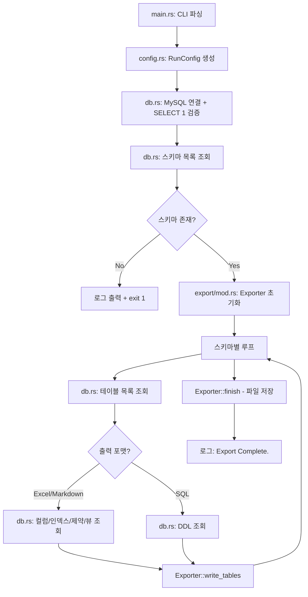
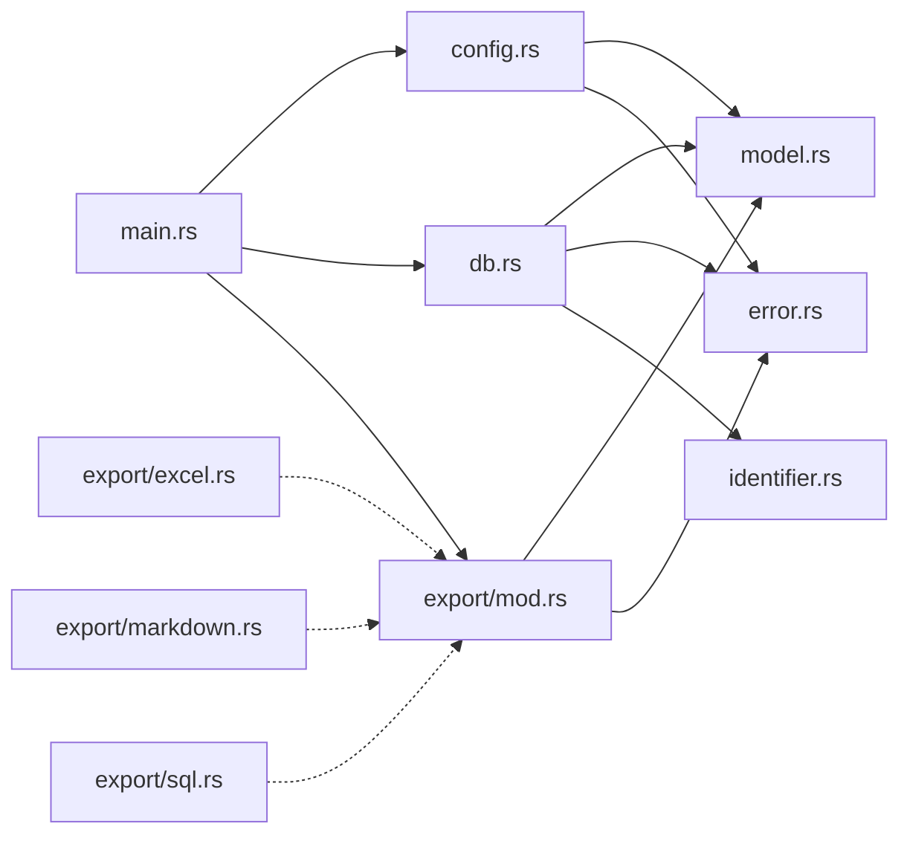

# 설계 문서: td-export-rust

## 개요

`td-export-rust`는 기존 Go 기반 TD-EXPORT 도구를 Rust로 재구현하는 프로젝트이다. MySQL `information_schema`에서 테이블/뷰 메타데이터를 수집하여 Excel(.xlsx), Markdown(.md), SQL(.sql) 포맷으로 내보내는 CLI 유틸리티이다.

### 설계 목표

1. **기능 동등성**: Go 버전과 동일한 CLI 인터페이스, 입력 처리, 출력 파일 구조 유지
2. **출력 호환성**: Excel 시트 레이아웃, Markdown 섹션 구성, SQL 덤프 포맷이 Go 버전과 의미적으로 동일
3. **안전성**: Rust 타입 시스템을 활용한 NULL 안전 처리, SQL 주입 방지, 비밀번호 비노출
4. **유지보수성**: 모듈 분리, 트레이트 기반 추상화, 테스트 가능한 구조

### Go → Rust 모듈 매핑

| Go 파일 | Rust 모듈 | 역할 |
|---------|-----------|------|
| `main.go` | `main.rs` | CLI 파싱, 파이프라인 조율 |
| `lib/common.go` | `config.rs` | 대화식 입력, `RunConfig` 생성 |
| `lib/db.go` | `db.rs` | MySQL 연결, 메타데이터 조회 |
| `lib/excel.go` | `export/excel.rs` | Excel 출력 |
| `lib/markdown.go` | `export/markdown.rs` | Markdown 출력 |
| `lib/sql.go` | `export/sql.rs` | SQL 출력 |
| — | `model.rs` | 데이터 모델 (구조체/열거형) |
| — | `error.rs` | 에러 타입 정의 |
| — | `export/mod.rs` | `Exporter` 트레이트 정의 |

---

## 아키텍처

### 프로젝트 구조

```
td-export-rust/
├── Cargo.toml
├── README.md
├── src/
│   ├── main.rs              # 진입점: CLI 파싱 → 파이프라인 실행
│   ├── config.rs             # RunConfig 생성 (대화식 입력 + CLI 플래그)
│   ├── db.rs                 # DB_Client: MySQL 연결 및 메타데이터 조회
│   ├── model.rs              # 데이터 모델 (TableDef, ColumnInfo 등)
│   ├── error.rs              # 에러 타입 (thiserror 기반)
│   ├── identifier.rs         # SQL 식별자 인용/검증 유틸리티
│   └── export/
│       ├── mod.rs            # Exporter 트레이트 정의
│       ├── excel.rs          # ExcelExporter 구현
│       ├── markdown.rs       # MarkdownExporter 구현
│       └── sql.rs            # SqlExporter 구현
└── tests/
    ├── config_test.rs        # 설정 파싱 단위 테스트
    ├── model_test.rs         # 데이터 모델 속성 테스트
    ├── identifier_test.rs    # 식별자 인용 속성 테스트
    ├── export_test.rs        # 출력 포맷 속성 테스트
    └── integration_test.rs   # 통합 테스트 (mock DB)
```

### 실행 흐름



### 주요 크레이트 선택

| 크레이트 | 용도 | 선택 근거 |
|---------|------|----------|
| `clap` (v4, derive) | CLI 인자 파싱 | Rust 생태계 표준, derive 매크로로 선언적 정의 |
| `sqlx` (mysql, runtime-tokio) | MySQL 비동기 드라이버 | 커넥션 풀 내장, 파라미터 바인딩, `Option` 매핑 |
| `tokio` (rt-multi-thread) | 비동기 런타임 | sqlx 의존성, 커넥션 풀 관리 |
| `rust_xlsxwriter` | Excel 출력 | 순수 Rust, excelize와 유사한 API |
| `tracing` + `tracing-subscriber` | 구조화 로깅 | Go logrus 대응, 레벨별 필터링 |
| `thiserror` | 에러 타입 정의 | 보일러플레이트 감소, source chain 자동 구현 |
| `anyhow` | main 에러 전파 | 최상위 에러 체인 출력 |
| `rpassword` | 비밀번호 입력 (에코 없음) | Go `terminal.ReadPassword` 대응 |
| `proptest` | 속성 기반 테스트 | Rust PBT 표준 라이브러리 |

---

## 컴포넌트 및 인터페이스

### 1. CLI 파싱 (`main.rs`)

```rust
use clap::Parser;

#[derive(Parser)]
#[command(name = "td-export", version, about = "Table Definition Export")]
struct Cli {
    /// 출력 포맷: excel, markdown, sql
    #[arg(long, default_value = "excel")]
    output: String,
}
```

`main` 함수는 얇게 유지한다:
1. `Cli::parse()`로 인자 파싱
2. `OutputFormat::from_str()`로 포맷 변환
3. `config::load_config()`로 `RunConfig` 생성
4. `db::DbClient::connect()`로 DB 연결
5. 스키마/테이블 수집 → Exporter 실행
6. 에러 시 적절한 종료 코드 반환

### 2. Config Loader (`config.rs`)

```rust
/// 대화식 프롬프트로 실행 설정을 수집한다.
pub fn load_config(output_format: OutputFormat) -> Result<RunConfig, AppError>
```

- `Endpoint`: 빈 입력 시 에러 반환
- `Port`: 빈 입력 시 기본값 `3306`, 유효 범위 `1..=65535` 검증
- `User`: 빈 입력 시 에러 반환
- `Password`: `rpassword::read_password()` 사용 (에코 없음)
- `DB`: 빈 입력 → 전체 비시스템 스키마, 쉼표 구분 → 대상 DB 목록
- `Exception Tables`: 빈 입력 → 제외 없음, 쉼표 구분 → 와일드카드 패턴 목록

### 3. DB Client (`db.rs`)

```rust
pub struct DbClient {
    pool: sqlx::MySqlPool,
}

impl DbClient {
    /// 커넥션 풀 생성 + SELECT 1 검증
    pub async fn connect(config: &RunConfig) -> Result<Self, AppError>;

    /// 스키마 목록 조회 (시스템 스키마 제외)
    pub async fn get_schemas(
        &self, config: &RunConfig,
    ) -> Result<SchemaCatalog, AppError>;

    /// 테이블 목록 + 일반 정보 조회
    pub async fn get_tables(
        &self, schema: &str, except: &[String],
    ) -> Result<Vec<TableDef>, AppError>;

    /// 컬럼 정보 조회 (BASE TABLE 전용)
    pub async fn get_columns(
        &self, schema: &str, table: &str,
    ) -> Result<Vec<ColumnInfo>, AppError>;

    /// 인덱스 정보 조회 (BASE TABLE 전용)
    pub async fn get_indexes(
        &self, schema: &str, table: &str,
    ) -> Result<Vec<IndexInfo>, AppError>;

    /// 제약 조건 조회 (BASE TABLE 전용)
    pub async fn get_constraints(
        &self, schema: &str, table: &str,
    ) -> Result<Vec<ConstInfo>, AppError>;

    /// 뷰 정의 조회 (VIEW 전용)
    pub async fn get_view_info(
        &self, schema: &str, table: &str,
    ) -> Result<ViewInfo, AppError>;

    /// DDL 조회 (SQL 포맷 전용)
    pub async fn get_table_ddl(
        &self, schema: &str, table: &str,
    ) -> Result<String, AppError>;
}
```

**보안 원칙:**
- 모든 WHERE 절 값은 `?` 파라미터 바인딩 사용
- `SHOW CREATE TABLE`에서 스키마/테이블 이름은 `identifier.rs`의 `quote_identifier()` 함수로 백틱 인용
- 비밀번호는 에러 메시지에 포함하지 않음

### 4. Exporter 트레이트 (`export/mod.rs`)

```rust
/// 출력 포맷별 구현을 위한 트레이트
pub trait Exporter {
    /// 초기 파일/워크북 설정
    fn setup(
        &mut self, catalog: &SchemaCatalog, config: &RunConfig,
    ) -> Result<(), AppError>;

    /// 한 스키마의 테이블 목록을 출력에 기록
    fn write_tables(
        &mut self, schema: &str, tables: &[TableDef],
    ) -> Result<(), AppError>;

    /// 파일 저장/닫기
    fn finish(&mut self) -> Result<(), AppError>;
}
```

팩토리 함수:
```rust
pub fn create_exporter(format: OutputFormat) -> Box<dyn Exporter>
```

### 5. 식별자 유틸리티 (`identifier.rs`)

```rust
/// MySQL 식별자를 백틱으로 인용한다.
/// 내부 백틱은 이중 백틱으로 이스케이프한다.
pub fn quote_identifier(id: &str) -> Result<String, AppError>;

/// 인용된 식별자에서 원본을 복원한다.
pub fn unquote_identifier(quoted: &str) -> Result<String, AppError>;

/// 식별자에 위험 문자(`;`, `/*`, `*/`, 개행)가 포함되어 있는지 검사한다.
pub fn validate_identifier(id: &str) -> Result<(), AppError>;
```

---

## 데이터 모델

### 핵심 구조체

```rust
/// 한 번의 실행에 필요한 모든 설정값 (불변)
#[derive(Debug, Clone)]
pub struct RunConfig {
    pub endpoint: String,
    pub port: u16,
    pub user: String,
    pub password: String,       // 로그 출력 금지
    pub target_db: Option<Vec<String>>,
    pub except_tables: Option<Vec<String>>,
    pub output_format: OutputFormat,
}

/// 출력 포맷 열거형
#[derive(Debug, Clone, Copy, PartialEq, Eq)]
pub enum OutputFormat {
    Excel,
    Markdown,
    Sql,
}

/// 스키마 → 테이블 목록 맵
pub type SchemaCatalog = HashMap<String, Vec<TableDef>>;

/// 한 테이블/뷰의 메타데이터 집합 (Go의 PerTable 대응)
#[derive(Debug, Clone, Default)]
pub struct TableDef {
    pub table_name: String,
    pub general: GeneralInfo,
    pub columns: Vec<ColumnInfo>,
    pub indexes: Vec<IndexInfo>,
    pub constraints: Vec<ConstInfo>,
    pub view: Option<ViewInfo>,
    pub ddl: Option<String>,
}

/// 테이블 일반 정보
#[derive(Debug, Clone, Default)]
pub struct GeneralInfo {
    pub table_type: String,         // "BASE TABLE" 또는 "VIEW"
    pub engine: Option<String>,
    pub row_format: Option<String>,
    pub collate: Option<String>,
    pub comment: Option<String>,
}

/// 컬럼 정보
#[derive(Debug, Clone)]
pub struct ColumnInfo {
    pub column_name: String,
    pub default_value: Option<String>,
    pub nullable: String,           // "YES" 또는 "NO"
    pub column_type: String,
    pub charset: Option<String>,
    pub collation: Option<String>,
    pub column_key: Option<String>,
    pub extra: Option<String>,
    pub comment: Option<String>,
}

/// 인덱스 정보
#[derive(Debug, Clone)]
pub struct IndexInfo {
    pub index_name: String,
    pub non_unique: i32,            // 1 = Normal, 0 = Unique
    pub index_columns: String,      // 쉼표 구분 컬럼 목록
}

/// 외래 키 제약 조건 정보
#[derive(Debug, Clone)]
pub struct ConstInfo {
    pub constraint_name: String,
    pub constraint_column: String,
    pub reference: String,          // "{table}.{column}" 형식
    pub delete_action: String,
    pub update_action: String,
}

/// 뷰 정의 정보
#[derive(Debug, Clone)]
pub struct ViewInfo {
    pub view_query: String,
    pub charset: String,
    pub collate: String,
}
```

### OutputFormat 직렬화/역직렬화

```rust
impl OutputFormat {
    pub fn from_str(s: &str) -> Result<Self, AppError> {
        match s.to_ascii_lowercase().as_str() {
            "excel" => Ok(Self::Excel),
            "markdown" => Ok(Self::Markdown),
            "sql" => Ok(Self::Sql),
            _ => Err(AppError::InvalidOutputFormat(s.to_string())),
        }
    }

    pub fn as_str(&self) -> &'static str {
        match self {
            Self::Excel => "excel",
            Self::Markdown => "markdown",
            Self::Sql => "sql",
        }
    }

    pub fn display_name(&self) -> &'static str {
        match self {
            Self::Excel => "Excel",
            Self::Markdown => "Markdown",
            Self::Sql => "SQL",
        }
    }
}
```

### 에러 타입 (`error.rs`)

```rust
use thiserror::Error;

#[derive(Error, Debug)]
pub enum AppError {
    #[error("잘못된 출력 포맷: {0}")]
    InvalidOutputFormat(String),

    #[error("필수 입력 누락: {0}")]
    MissingInput(String),

    #[error("잘못된 포트 번호: {0}")]
    InvalidPort(String),

    #[error("DB 연결 실패 ({endpoint}:{port}): {source}")]
    DbConnection {
        endpoint: String,
        port: u16,
        #[source]
        source: sqlx::Error,
    },

    #[error("메타데이터 조회 실패 ({schema}.{table}): {source}")]
    MetadataQuery {
        schema: String,
        table: String,
        #[source]
        source: sqlx::Error,
    },

    #[error("스키마를 찾을 수 없음")]
    NoSchemas,

    #[error("안전하지 않은 식별자: {0}")]
    UnsafeIdentifier(String),

    #[error("파일 쓰기 실패: {source}")]
    FileWrite {
        #[source]
        source: std::io::Error,
    },

    #[error("Excel 생성 실패: {0}")]
    ExcelWrite(String),

    #[error("입력 읽기 실패: {source}")]
    InputRead {
        #[source]
        source: std::io::Error,
    },
}
```

### 컴포넌트 의존성 다이어그램




---

## 정확성 속성 (Correctness Properties)

*속성(property)이란 시스템의 모든 유효한 실행에서 참이어야 하는 특성 또는 동작이다. 사람이 읽을 수 있는 명세와 기계가 검증할 수 있는 정확성 보장 사이의 다리 역할을 한다.*

### Property 1: OutputFormat 왕복 및 전체성 (Round-trip & Totality)

*For any* `OutputFormat` 변형(variant)에 대해, `as_str()`로 문자열 변환 후 `from_str()`로 다시 파싱하면 원본 변형과 동일해야 한다. 또한 *for any* 임의의 문자열 입력에 대해 `from_str()`은 `Ok` 또는 `Err`만 반환하며 패닉을 일으키지 않아야 한다. 추가로, *for any* 유효한 포맷 문자열의 임의 대소문자 조합에 대해 `from_str()`은 올바른 변형을 반환해야 한다.

**Validates: Requirements 1.3, 1.4**

### Property 2: 포트 파싱 전체성 (Port Parse Totality)

*For any* 임의의 문자열 입력에 대해, 포트 파서는 `Ok(u16)` (값이 1..=65535 범위) 또는 `Err`만 반환하며 패닉하지 않아야 한다. 빈 문자열 입력에 대해서는 항상 기본값 `3306`을 반환해야 한다.

**Validates: Requirements 2.3, 2.4**

### Property 3: 쉼표 구분 입력 파싱 (Comma-Separated Input Parsing)

*For any* 임의의 문자열 입력에 대해, 쉼표 구분 파서는 빈 입력이면 `None`을, 비어있지 않은 입력이면 쉼표로 분리된 `Vec<String>`을 반환해야 한다. 분리된 각 요소는 원본 입력의 쉼표 사이 부분 문자열과 일치해야 한다.

**Validates: Requirements 2.7, 2.8**

### Property 4: 비밀번호 비노출 (Password Non-Leak)

*For any* 임의의 비밀번호 문자열(ASCII 비인쇄 문자, 유니코드 포함)에 대해, 전체 로그 출력, 에러 메시지, 출력 파일 어디에도 해당 비밀번호 문자열이 나타나지 않아야 한다. 특히 `AppError::DbConnection`의 `Display` 출력에는 엔드포인트와 포트가 포함되되 비밀번호는 포함되지 않아야 한다.

**Validates: Requirements 2.9, 3.3, 12.8**

### Property 5: 스키마 필터링 정확성 (Schema Filtering Correctness)

*For any* 스키마 이름 집합에 대해, 필터링 결과에는 시스템 스키마(`information_schema`, `mysql`, `sys`, `performance_schema`, `tmp`)가 하나도 포함되지 않아야 한다. 또한 `target_db`가 지정된 경우, 반환된 스키마 목록은 `target_db`의 부분집합이어야 한다.

**Validates: Requirements 4.2, 4.4**

### Property 6: NULL-to-Option 매핑 정확성

*For any* `(값, is_null)` 쌍에 대해, `is_null == true`이면 매핑 결과는 `Option::None`이고, `is_null == false`이면 `Option::Some(값)`이어야 한다. 이 매핑은 전단사(bijective)이다.

**Validates: Requirements 5.4**

### Property 7: 컬럼 순서 보존 (Column Ordinal Order Preservation)

*For any* 컬럼 목록에 대해, 반환된 `Vec<ColumnInfo>`는 `ordinal_position` 오름차순으로 정렬되어 있어야 한다(단조 증가).

**Validates: Requirements 6.1**

### Property 8: 테이블별 실패 격리 (Per-Table Failure Isolation)

*For any* 테이블 목록에서 하나의 테이블에 대한 메타데이터 조회가 실패하더라도, 나머지 테이블의 수집 결과는 영향을 받지 않아야 한다. 실패한 테이블을 제외한 나머지 테이블의 데이터는 실패가 없었을 때와 동일해야 한다.

**Validates: Requirements 6.7, 7.3**

### Property 9: 출력 파일명 결정성 (Filename Determinism)

*For any* 스키마 이름과 엔드포인트 문자열에 대해:
- Markdown 출력 파일명은 항상 `{schema}.md`이다.
- Excel 출력 파일명은 항상 `{endpoint}.xlsx`이다.
- SQL 출력 파일명은 항상 `{schema}({endpoint}).sql`이다.

동일한 입력에 대해 파일명은 항상 동일하다.

**Validates: Requirements 9.1, 10.5, 11.1**

### Property 10: Markdown 출력 완전성 (Markdown Output Completeness)

*For any* `TableDef` 집합 `T`에 대해:
- `## Table List` 섹션 아래에 정확히 `|T|`개의 불릿 항목이 존재한다.
- `## {table}` 섹션의 수는 `|T|`와 동일하다.
- `table_type == "BASE TABLE"`인 테이블은 일반 정보 표, 컬럼 표, (존재 시) 인덱스/제약 섹션을 포함한다.
- `table_type == "VIEW"`인 테이블은 뷰 정보 표와 View Create SQL 섹션을 포함한다.
- `Option::None` 필드는 빈 문자열로 렌더링된다.

**Validates: Requirements 9.3, 9.4, 9.5, 9.6**

### Property 11: Excel 시트 수 동등성 (Sheet Count Equality)

*For any* 스키마 집합에 대해, 생성된 워크북의 시트 수는 스키마 수와 동일하다(기본 `Sheet1`이 제거된 뒤).

**Validates: Requirements 10.1**

### Property 12: Excel 행 번호 단조 증가 (Monotonic Row Advance)

*For any* 테이블에 대해, Excel에 한 테이블 블록을 기록하는 동안 사용된 행 번호는 시작값보다 반드시 커진 상태로 종료한다.

**Validates: Requirements 10.3**

### Property 13: DDL 보존 왕복 (DDL Preservation Round-Trip)

*For any* DDL 문자열에 대해, SQL 파일에 기록한 뒤 `DROP TABLE IF EXISTS ...;\n` 접두어와 트레일링 `;\n\n\n`을 제거하면 원본 DDL 문자열과 일치한다. 또한 `/* Table : */` 주석 수는 처리된 테이블 수와 동일하다.

**Validates: Requirements 11.3, 11.4**

### Property 14: 에러 체인 보존 (Error Chain Preservation)

*For any* 내부 오류에 대해, `AppError`의 `source()` 체인에는 원본 오류 타입이 보존되어야 한다. `thiserror`의 `#[source]` 어노테이션을 통해 기저 드라이버 오류까지 추적 가능해야 한다.

**Validates: Requirements 13.7**

### Property 15: 식별자 인용 왕복 (Identifier Quoting Round-Trip)

*For any* 유효한 MySQL 식별자 문자열 `id`에 대해, `unquote_identifier(quote_identifier(id)) == id`이다. 또한 *for any* 위험 문자(`` ` ``, `;`, `/*`, `*/`, 개행)를 포함하는 문자열에 대해, `quote_identifier`는 안전하게 이스케이프하거나 `validate_identifier`가 에러를 반환한다.

**Validates: Requirements 14.2**

### Property 16: 유니코드 보존 왕복 (Unicode Preservation Round-Trip)

*For any* 유니코드 문자열(한국어, 일본어, 중국어, 이모지 포함)을 스키마/테이블 이름으로 사용할 때, 출력 파일에 기록한 뒤 다시 읽어들이면 원본과 바이트 단위로 일치한다. 출력 파일은 UTF-8 인코딩이며 BOM을 포함하지 않는다.

**Validates: Requirements 15.4, 15.5**

---

## 에러 처리

### 에러 분류

| 분류 | 동작 | 종료 코드 | 예시 |
|------|------|----------|------|
| **치명적 (Fatal)** | 로그 ERROR + 즉시 종료 | 1 | 필수 입력 누락, DB 연결 실패, 스키마 없음, 파일 쓰기 실패 |
| **복구 가능 (Recoverable)** | 로그 WARN/ERROR + 계속 진행 | 0 (후속 실패 없으면) | 개별 테이블 메타데이터 조회 실패 |
| **성공** | 로그 INFO | 0 | 정상 완료 |

### 에러 전파 전략

```
main.rs
  └─ anyhow::Result<()> 반환
      └─ AppError (thiserror 기반)
          ├─ #[source] sqlx::Error     — DB 관련 에러
          ├─ #[source] std::io::Error  — 파일 I/O 에러
          └─ 자체 변형                   — 입력 검증, 식별자 안전성 등
```

- `main()`에서 `anyhow::Result`를 사용하여 최상위 에러 체인을 출력
- 각 모듈은 `AppError`를 반환하며, `?` 연산자로 전파
- 개별 테이블 실패는 `match` + `tracing::error!`로 처리 후 `continue`

### 비밀번호 보호

- `RunConfig`의 `Debug` 구현에서 `password` 필드를 `"[REDACTED]"`로 대체
- `AppError::DbConnection`에 `password` 필드를 포함하지 않음
- 모든 `tracing` 매크로 호출에서 `password` 값을 직접 참조하지 않음

### 종료 코드 매핑

```rust
fn main() {
    let result = run();
    match result {
        Ok(()) => std::process::exit(0),
        Err(e) => {
            tracing::error!("{:#}", e);
            std::process::exit(1);
        }
    }
}
```

---

## 테스트 전략

### 테스트 프레임워크

| 도구 | 용도 |
|------|------|
| `cargo test` | 단위 테스트 + 통합 테스트 실행 |
| `proptest` | 속성 기반 테스트 (PBT) |
| `mockall` 또는 트레이트 기반 mock | DB 의존성 모킹 |
| `tempfile` | 출력 파일 테스트용 임시 디렉터리 |

### 이중 테스트 접근법

**단위 테스트 (example-based):**
- 특정 입력/출력 시나리오 검증
- 엣지 케이스: 빈 입력, 경계값, 에러 경로
- 통합 지점: CLI 파싱, DB mock 연동

**속성 기반 테스트 (property-based):**
- 모든 유효 입력에 대한 보편적 속성 검증
- 최소 100회 반복 실행
- 각 테스트에 설계 문서 속성 번호 태그 부착

### PBT 설정

```rust
use proptest::prelude::*;

proptest! {
    #![proptest_config(ProptestConfig::with_cases(100))]

    // Feature: td-export-rust, Property 1: OutputFormat round-trip
    #[test]
    fn output_format_round_trip(fmt in prop_oneof![
        Just(OutputFormat::Excel),
        Just(OutputFormat::Markdown),
        Just(OutputFormat::Sql),
    ]) {
        let s = fmt.as_str();
        let parsed = OutputFormat::from_str(s).unwrap();
        prop_assert_eq!(parsed, fmt);
    }
}
```

### 테스트 매트릭스

| 속성 | 테스트 유형 | 모듈 | 반복 횟수 |
|------|-----------|------|----------|
| Property 1: OutputFormat 왕복 | PBT | `model_test` | 100+ |
| Property 2: 포트 파싱 전체성 | PBT | `config_test` | 100+ |
| Property 3: 쉼표 구분 파싱 | PBT | `config_test` | 100+ |
| Property 4: 비밀번호 비노출 | PBT | `error_test` | 100+ |
| Property 5: 스키마 필터링 | PBT | `db_test` (mock) | 100+ |
| Property 6: NULL-to-Option 매핑 | PBT | `model_test` | 100+ |
| Property 7: 컬럼 순서 보존 | PBT | `db_test` (mock) | 100+ |
| Property 8: 실패 격리 | PBT | `db_test` (mock) | 100+ |
| Property 9: 파일명 결정성 | PBT | `export_test` | 100+ |
| Property 10: Markdown 완전성 | PBT | `export_test` | 100+ |
| Property 11: Excel 시트 수 | PBT | `export_test` | 100+ |
| Property 12: Excel 행 단조 증가 | PBT | `export_test` | 100+ |
| Property 13: DDL 보존 왕복 | PBT | `export_test` | 100+ |
| Property 14: 에러 체인 보존 | PBT | `error_test` | 100+ |
| Property 15: 식별자 인용 왕복 | PBT | `identifier_test` | 100+ |
| Property 16: 유니코드 보존 왕복 | PBT | `export_test` | 100+ |

### 단위 테스트 (example-based) 대상

| 대상 | 테스트 내용 |
|------|-----------|
| CLI 파싱 | `--output excel`, `--help`, `--version`, 잘못된 값 |
| Config Loader | 빈 Endpoint/User 에러, 기본 포트 3306, 비밀번호 에코 없음 |
| DB Client | 연결 성공/실패, SELECT 1 검증, 타임아웃 |
| Excel Exporter | Sheet1 삭제, 스타일 정의, VIEW collation 소스 |
| SQL Exporter | DDL 원본 보존, 파일 헤더 포맷 |
| 로깅 | 필수 메시지 출력 확인, 비밀번호 미포함 |
| 종료 코드 | 성공=0, 각 실패 유형=1 |

### 통합 테스트

- 테스트용 MySQL 인스턴스(Docker) 또는 mock을 사용
- 전체 파이프라인 실행: 입력 → DB 조회 → 파일 생성
- 생성된 파일의 구조 및 내용 검증
- `#[cfg(feature = "integration")]` 게이트로 통합 테스트 분리

### CI 파이프라인

```yaml
# 예시 CI 단계
- cargo fmt --check
- cargo clippy --all-targets --all-features -- -D warnings
- cargo test --all-features
- cargo test --features integration  # 통합 테스트 (MySQL 필요)
```
